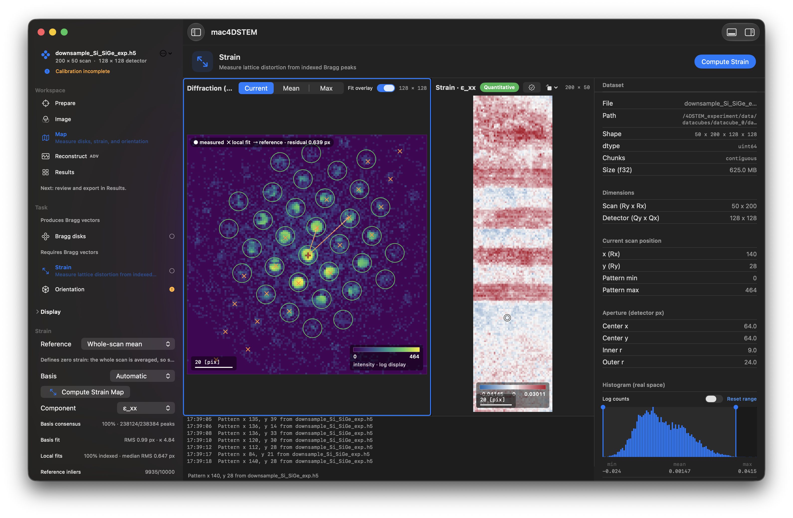

# mac4DSTEM

**Interactive 4D-STEM analysis, native to Apple Silicon.**

---

## Overview

Four-dimensional scanning transmission electron microscopy records a complete
convergent-beam electron diffraction pattern at every probe position. The
resulting datasets are large, and the analysis that extracts science from them —
virtual imaging, strain, orientation, phase reconstruction — has conventionally
been performed offline, in scripted environments, at a remove from the data.

mac4DSTEM brings that analysis into an interactive application. Detector
geometry, calibration and reconstruction parameters can be adjusted against a
live view of the data, so the effect of a decision is visible as it is made
rather than after a batch run completes.

The application is built directly on Apple Silicon's unified memory and GPU. Its
algorithms are ported from [py4DSTEM](https://github.com/py4dstem/py4DSTEM) and
validated against it on experimental data, so results are traceable to the
established reference implementation in the field.

## Capabilities

- **Data exploration** — real and reciprocal space presented together, with
  calibrated scale bars, contrast control and GPU-rendered CBED display
- **Virtual imaging** — bright-field, annular dark-field and HAADF geometries,
  plus arbitrary annular, rectangular and point detectors positioned
  interactively on the diffraction plane
- **Calibration** — probe and origin fitting across the scan, elliptical
  distortion correction, real–reciprocal rotation, and reciprocal-space
  sampling against a known crystal
- **Bragg disk detection** — GPU cross-correlation with parabolic and
  DFT-upsampled subpixel refinement, and live acceptance diagnostics
- **Strain mapping** — robust local lattice fitting against a whole-scan or
  region reference, with basis consensus, residual and indexed fraction
  reported alongside every map
- **Orientation mapping** — polar-correlation template matching against a
  validated crystal catalogue or an imported CIF, with reliability and
  inverse-pole-figure output
- **Phase reconstruction** — DPC, iDPC, parallax and single-slice ptychography
- **Interoperability** — EMD export of Bragg vectors, calibrated datacubes and
  preprocessed products, readable directly in py4DSTEM

Every quantity carries its calibration and its provenance through display,
export and reopening. Where a measurement is not quantitatively supported, the
result is labelled accordingly rather than presented as though it were.

<!-- TODO: 2-3 screenshots — virtual imaging, a strain map, an orientation map. -->

## Status

**v1.0.0** — first release. The analysis workflow is complete and covered by 30
automated test suites, including parity harnesses measured against py4DSTEM
0.14.19 on experimental datasets.

Stated precisely: that verification is numerical. The application is tested
against known-correct values, not against its rendered output. The Merlin MIB
and EMPAD RAW readers remain preview-grade pending further vendor data. Current
limitations are documented in [`docs/open-items.md`](docs/open-items.md).

## Requirements

macOS 14 or later on Apple Silicon. No external runtime, toolchain or library
installation is required; all dependencies are contained within the application.

## Building from source

Open `mac4DSTEM.xcodeproj` in Xcode and build the `mac4DSTEM` scheme.

Architecture, test suites, supported file formats and known limitations are
documented in [`docs/technical-overview.md`](docs/technical-overview.md). Scope
and release contracts are in [`docs/v1-scope.md`](docs/v1-scope.md) and
[`CHANGELOG.md`](CHANGELOG.md); the analysis pipelines and their correspondence
to py4DSTEM are described in
[`docs/py4dstem-pipelines.md`](docs/py4dstem-pipelines.md).

## Attribution and licence

mac4DSTEM implements algorithms ported from
**[py4DSTEM](https://github.com/py4dstem/py4DSTEM)** and validated against it.
Work published using mac4DSTEM should cite py4DSTEM for the underlying methods.

Released under the **GNU General Public License v3.0**. See
[`LICENSE`](LICENSE) and [`NOTICE`](NOTICE).

## Contact

Enquiries, issue reports and collaboration: **mail@mac4dstem.com**
