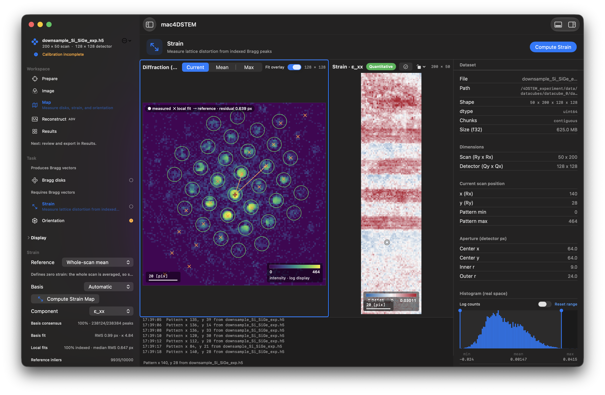

<h1 align="center">mac4DSTEM</h1>

  <strong>Interactive 4D-STEM analysis, native to Apple Silicon.</strong>

  

  

Strain map (screenshot from v2.5.0, 2026-09-04).

---

4D-STEM records a full diffraction pattern at every probe position. Analysing
those datasets — virtual imaging, strain, orientation, phase — usually happens
offline, in scripts, away from the data. mac4DSTEM does it interactively:
detector geometry, calibration and reconstruction parameters change against a
live view, so you see what a choice does while you make it.

Algorithms are ported from [py4DSTEM](https://github.com/py4dstem/py4DSTEM) and
gated against it, so results trace back to the reference implementation.

## New in v4.1.0 (2026-10-02)

- **Workspaces that follow the data:** Prepare · Imaging · Bragg Disks · Crystal
  Maps · Reconstruction · Results. Results › **Export Data…** writes the product
  on screen as an EMD RealSlice `.h5`.
- **Preprocess Raw Data…** crops, strides and hot-pixel-filters a raw file (a
  port of py4DSTEM's filter) without touching the source; **Keep in memory**
  for cubes that fit.
- **Train a Bragg-disk detector in the app** (the Train Model… flow is not yet
  verified on screen) and run the learned detector on the Neural Engine.
- **ACOM** gains py4DSTEM's mirror pass; a calibration change marks dependent
  results stale, with **Rewind to Here** in the lineage.
- **Numbers that moved:** the default disk-detection floor is 0.15 % (a
  documented deviation from py4DSTEM), the R–Q rotation follows py4DSTEM's sign,
  and binned views' mean patterns can differ in their last float32 bits.
- **A whole-app pre-release review** fixed data-safety, memory and wording
  defects, each with a test. Phase mapping and its precipitate products stay
  labelled unvalidated; known limitations are at the end of the v4.1.0 notes.

Full notes: [`CHANGELOG.md`](CHANGELOG.md).

## What it does

- **Explore** real and reciprocal space together, calibrated and GPU-rendered.
- **Virtual imaging** — BF, ADF, HAADF, plus annular, rectangular and point
  detectors placed by hand.
- **Calibration** — probe and origin fitting, elliptical distortion,
  real–reciprocal rotation, reciprocal sampling from a known crystal.
- **Bragg disks** — cross-correlation on the CPU over an exact Bluestein FFT
  (no GPU correlation kernel exists), parabolic and DFT-upsampled subpixel,
  live acceptance diagnostics.
- **Strain** — robust local lattice fitting, with basis consensus, residual and
  indexed fraction on every map.
- **Orientation** — polar-correlation template matching against a structure from
  the Materials Project (by mp-id) or your own CIF, with reliability and IPF output.
- **Phase** — DPC, iDPC, parallax, single-slice ptychography.
- **Export** — EMD Bragg vectors, datacubes and products, readable in py4DSTEM.

Every quantity carries its calibration and provenance through display, export
and reopening. Where a measurement is not quantitatively supported, it says so.

## Verification

Every number behind a release — gate exit status and counts, DMG hash,
notarization and staple details — is quoted from the run that produced it in
[`docs/releasing.md`](docs/releasing.md) § Releases, with the full history in
[`CHANGELOG.md`](CHANGELOG.md).

The badge covers three jobs on every push: `scientific` (the science harnesses;
the learned detector's half of one memory gate is skipped there, as the CI runner
has no Neural Engine), the repository's own `inventory` review, and `core`, which
fails the moment `Core/` reaches up into the app. The `unit` job is paused
([ADR 040](docs/decisions/040-four-owner-decisions-2026-09-28.md): the macos-26
image cannot build a macOS 27 app). Every gate, `unit` included, runs locally
before each release.

All of that is numerical — the app is tested against known-correct values, not
against what it draws. What it draws is checked by a person driving it, because
the numerical gate has stayed green through real on-screen defects.

Merlin MIB and EMPAD RAW readers are preview-grade. Current limitations:
[`docs/open-items.md`](docs/open-items.md).

## Requirements

macOS 27 or later on Apple Silicon. Nothing else to install — every dependency
ships inside the application. Older systems: the v3.0.0 download (macOS 14+)
stays available.

Development and testing happen on macOS 27. The build supports 27 and later —
that is the enforced minimum, not a claim every version has been exercised — so
if something misbehaves on an older system, a report with the version in it is
especially useful.

## Building

Open `mac4DSTEM.xcodeproj` and build the `mac4DSTEM` scheme.

Architecture and supported formats: [`docs/architecture.md`](docs/architecture.md).
What is live now: [`docs/status.md`](docs/status.md). The pipelines and their
correspondence to py4DSTEM: [`docs/py4dstem-pipelines.md`](docs/py4dstem-pipelines.md).

## Contributing

Issue reports — especially parity discrepancies with numbers attached — are
welcome. [`CONTRIBUTING.md`](CONTRIBUTING.md) covers what makes a scientific bug
report actionable.

## Citing

Please cite mac4DSTEM and py4DSTEM, the origin of the underlying methods.
Metadata for both: [`CITATION.cff`](CITATION.cff).

## Licence

Algorithms ported from [py4DSTEM](https://github.com/py4dstem/py4DSTEM) and
validated against it. Released under the **GNU General Public License v3.0 or
later** — see [`LICENSE`](LICENSE) and [`NOTICE`](NOTICE).

## Contact

**mail@mac4dstem.com**
