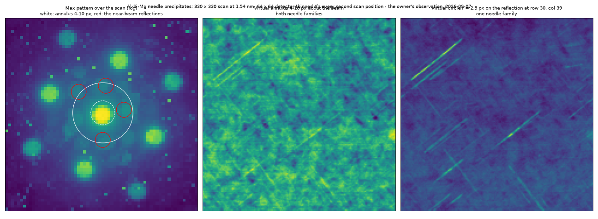

# AI/ML development brief

Discussion: 2026-09-06. Purpose: turn today's product discussion into a basis
for bounded development sessions. This is a direction and design brief, not
an implementation claim, release promise, or authorization to build every idea.

The owner endorsed a central home for AI features and expressed particular
interest in precipitate segmentation/counting, thickness estimation, and
diffraction clustering. The exact navigation design and implementation order
remain open. Additional opportunities below are recommendations discussed,
not separately approved feature commitments.

## 1. Where this brief fits

- [Status](../status.md) remains the authority for current work and next steps.
- [v3 plan](../v3-plan.md) owns the overall sequence and the existing disk
  detector pre-registration (§3a). Its overnight verdict was subsequently
  corrected in status; do not read that historical verdict as acceptance.
- [Open items](../open-items.md) owns unresolved defects and verification debt.
- [Development process](../development-process.md), [architecture](../architecture.md),
  and [decisions](../decisions.md) retain their existing roles.
- This folder owns the cross-feature AI product brief and, when work starts,
  focused feature specifications. It is not another live status table.

A separate home is justified because the owner requested a durable summary
of the broader AI direction; appending it to the already long disk-detector
pre-registration would mix independent features with that experiment.
Markdown grows deliberately for this requested artifact.

## 2. What last night established, and what it did not

The `ml/disk-detector` branch established the Python workflow: simulate,
train a small model in PyTorch, export to Core AI, hash the assets, and run
inference with Neural Engine preferred. Core ML export exists as tooling
insurance. The selected app runtime remains Core AI, with the learned option
planned for macOS 27 and classical functionality retained on older systems.

This is a reusable platform milestone. It is not proof that the disk detector
is scientifically accepted or that a shared Swift runtime already exists.
Loading, batching, product provenance, review UI, and correction persistence
still need an app implementation. Compute preference alone does not establish
every operation's placement; inspect the actual execution path.

Today's review found training targets for nearly extinct reflections,
texture-free radial training backgrounds, refinement without rejection or
duplicate removal, a restrictive early candidate cap, intensity-unit-sensitive
normalisation, and evaluation using PyTorch rather than exported outputs.
The suggested link between target semantics and false detections needs an
experiment, not just a plausible explanation. The overnight throughput claim
used the wrong baseline; compare against the app's actual parallel scan path.
Threshold 0.9 retained raw fixture recall in the saved run, but that does not
establish a universal operating threshold. Read current status before changing
the detector: implementation and follow-up review are continuing elsewhere.

## 3. Product direction and placement in the app

Proposed: an optional **AI Analysis** workspace in the existing left sidebar,
alongside Prepare, Imaging, Strain & ACOM, Phase, and Results. The name, order,
icon, keyboard shortcut, and internal navigation are undecided. No UI has been
built or accepted on screen as part of this discussion.

The workspace presents tasks, not model architecture or a chatbot:

| Tool | Primary user action | Saved result |
|---|---|---|
| Precipitates | Segment, correct, count, and measure objects | Object masks, measurements, distributions, analysed extent |
| Thickness | Analyse averaged diffraction from a selected region | Thickness/mistilt estimate, fit evidence, validity and uncertainty |
| Diffraction groups | Group patterns and inspect representative examples | Group map, representatives, selected regions |
| Disk detection | Compare learned and classical proposals | Accepted peaks with detector provenance |

Common flow: **choose inputs → run → inspect/correct → save result**.
Results remain discoverable in the existing Results workspace and session
sidecar, with their AI method recorded. Central access need not isolate the
tools: possible contextual shortcuts are “Segment this image” in Imaging and
“Find similar patterns” in a diffraction pane. These are design proposals.

Trust is a product requirement. Processing should be local, explicitly
started, cancellable, and clear about its inputs and model. Preserve original
data; distinguish predictions, user corrections, and accepted measurements.
Show comparison/fit evidence and unresolved regions. A model score is not
automatically a calibrated probability or scientific uncertainty. Familiar
classical workflows remain available. User corrections should be retained as
labelled examples, with later retraining explicit rather than silent.

## 4. Priority feature: precipitate segmentation and counting

Goal: turn a 4D-STEM scan into inspectable individual precipitates and the
statistics a microscopist needs. Start from virtual images; a learned phase
classifier is not a prerequisite for a contrast-based first version.

**The dataset and the owner's observation (2026-09-07).**
`References/training_dataset/Al_SiMg_Precipitates_SI60_preprocessed_unfiltered_bin_4_20260712.h5`:
330 × 330 scan positions at 1.54 nm, a 64 × 64 detector (binned 4,
0.046 Å⁻¹ per pixel), Al matrix on a zone axis. The needle precipitates are
faint in virtual BF and ADF, and plain in two other views the owner found in
the app: the **Max** diffraction pattern over the scan shows the
precipitate reflections **close to the central beam, inside the first ring
of matrix disks** (at 7–10 px of the 64, where the matrix disks sit at
~18 px), and a virtual detector on that region lights the needles up — an
annulus of 4–10 px about the beam shows both needle families, a 2.5-px
circle on ONE of those reflections shows one family only, so the families
are separable by the reflection they diffract into. Reproduced from the
cube (every second scan position) in
`docs/images/precipitates-al-simg-near-beam-2026-09-07.png`:

What it decides for the design: the segmentation stack's most informative
channels are **one dark-field image per near-beam reflection** (each
selects a needle family by orientation), beside BF/ADF; the phase
classifier's signal (chain step 1) is exactly those reflections; and the
needles run along two perpendicular in-plane directions, so a
centre-plus-orientation representation fits. This detector is 64 px, below
the learned disk detector's 128-px input — irrelevant here, the precipitate
work is a virtual-image task.

Proposed workflow:

1. Select the analysed region and useful virtual BF/ADF/dark-field images —
   for this material, the near-beam precipitate reflections first.
2. Propose individual particle/needle masks, including separation of touching
   objects. A small segmentation model is a candidate, not a settled design.
3. Let the user add, remove, split, merge, and correct objects.
4. Calculate calibrated length, width, area, orientation and distributions
   using explicit geometric definitions. Define edge-crossing and excluded
   objects before reporting a count.
5. Average original diffraction within each accepted mask for optional
   per-object phase/orientation analysis; future phase or strain maps can
   supply additional evidence or segmentation channels.
6. Save/export object identities, masks, measurements, corrections, provenance
   and the actual analysed extent.

The central architecture change is a per-object result: a list of particles
with masks and attributes, rather than only one field per scan position.
Name its store/session owner before implementation; add no AppState storage.
Synthetic shapes can bootstrap training, but acceptance needs independent
real-object annotations, including faint, touching and overlapping cases.
Compare with a simple threshold/connected-component baseline.

## 5. Thickness and the path to number density

Goal: estimate foil thickness and mistilt from position-averaged convergent
beam electron diffraction (PACBED), initially for one material and supported
acquisition geometry. Train with appropriate multislice simulations; validate
against independent thickness evidence and real acquisitions. Show the
observed pattern beside the predicted or best-fit simulated pattern.

Thickness is not a universal model inferred from any arbitrary averaged
pattern. Define material, orientation, convergence angle, detector sampling,
averaging-region requirements, valid range, and failure/uncertainty behaviour.
Map spatial variation only at a resolution the averaging and validation support.

- Areal number density: accepted count divided by the calibrated analysed area.
- Volumetric number density: accepted count divided by an appropriate analysed
  volume; for a supported thickness map this involves area-weighted thickness.
- Thickness alone does not settle counting completeness, projection overlap,
  edge conventions or stereological assumptions. Record these, exclusions and
  uncertainty with the result; do not silently turn an areal count into a
  volumetric claim.

The desired chain is **segment → review objects → measure/count → establish
area → validate thickness/volume → report density with its assumptions**.
Published PACBED work establishes scientific precedent, not validation of our
implementation (references below).

## 6. Diffraction clustering, similarity and discovery

Goal: find structure throughout a scan without manually inspecting every
pattern. A compact learned encoder could support grouping, representative
patterns, unusual-pattern maps and “find more like this” from one selection.
Cache representations for repeated exploration when their model, input view,
normalisation and calibration dependencies match.

Groups initially mean similar diffraction, not identified phases: orientation,
thickness, dose and detector effects can also separate patterns. Define which
variations an embedding should retain or ignore. Compare with PCA/NMF or other
simple baselines and evaluate on acquisitions excluded from development.
An ANE-friendly encoder is a design choice to test; an external research model
does not automatically export or generalise to this app.

## 7. Further opportunities discussed — exploratory

| Opportunity | Proposed benefit | Required discriminator |
|---|---|---|
| Suggested virtual detectors | Mark precipitate and matrix examples; suggest an editable diffraction-space mask/weight image, then integrate original intensities | Contrast improvement on held-out examples; inspectable mask and saved recipe |
| ACOM shortlisting | Predict likely phase/orientation candidates; existing matching scores/refines them and broadens ambiguous searches | Retain the exhaustive search winner while reducing total time |
| Quality/region masks | Suggest vacuum, amorphous, crystalline or unusable regions | Independent labels; show uncertainty and allow correction |
| Informative review queue | Surface uncertain boundaries, rare objects and representative patterns for annotation | Include random audits so confident mistakes are not invisible |
| Fast simulation-based fitting | Approximate forward simulations for interactive thickness/tilt searches, verify selected fits physically | Surrogate error over a declared domain and final physical checks |
| Denoising/reconstruction previews | Improve inspection or initialise expensive analysis | Preserve raw data; test downstream bias, not appearance alone |
| Inpainting | Propose missing detector content | Explicitly mark inferred pixels; no invisible substitution into measurements |
| Acquisition assistance | Flag drift, contamination, damage or informative regions | Acquisition integration and independently tested flags; unscheduled |

Do not interpret “ANE proposes, Metal measures” as a scientific prohibition:
validated neural models can estimate quantities directly, including thickness.
Nor is Core AI an ANE-only framework. Allocate work by supported operations,
precision, measured speed and scientific evidence. Each model needs its own
benchmark; the disk detector's per-pattern time is not a universal ANE cost.

## 8. Repository and documentation structure

Keep one repository and preserve its dependency layers. A central AI workspace
does not imply a top-level source folder containing every layer.

| Home | Responsibility | State |
|---|---|---|
| `docs/ai-ml/README.md` | This brief and future specification index | Created for this request |
| `docs/ai-ml/<feature>.md` | One active feature's scope, inputs, state owner, validation and decisions | Create only when that feature starts |
| `docs/v3-plan.md` | Cross-feature sequence and existing disk-detector pre-registration | Existing; link rather than duplicate |
| `docs/status.md`, `docs/open-items.md`, `docs/decisions.md` | Live progress, defects/debt, durable decisions respectively | Existing authorities |
| `docs/archive/` | Completed investigation and superseded evidence narratives | Existing |
| `tools/disk-detector/` and future task-specific tooling | Python simulation, training, export and checks | Detector tooling exists; shared utilities only after demonstrated reuse |
| `mac4DSTEM/Core/ML/` | Shared inference and model contracts within DSTEMCore | Proposed; do not create empty scaffolding |
| `mac4DSTEM/Session/` | Result/correction ownership, persistence and replay | Extend existing layer as needed |
| `mac4DSTEM/UI/` and `mac4DSTEM/App/` | Workspace presentation and application orchestration | Extend existing layers as needed |
| Bundled model resources | Versioned, hashed assets; no surprise runtime download | Packaging location to decide during integration |
| Gitignored `References/` | Owner-local datasets, training runs and large diagnostic outputs | Existing; public acceptance needs reproducible fixtures |

Each feature specification should contain: user outcome/non-goals; proposed
screens; owner of state; input/output and coordinate/unit contracts; training
data and held-out evaluation; baseline; pre-registered acceptance criteria;
runtime/resource budget; save/reopen/export semantics; unresolved decisions;
and links to retained evidence. Do not duplicate the general repo rules or
copy changing test counts into multiple documents. This brief adds no rules
to AGENTS.md or CLAUDE.md.

## 9. Recommended development sequence and gates

1. Resolve the disk detector's current evaluation/throughput decision using
   current status. Platform feasibility and detector acceptance stay separate.
2. Carry one bounded model workflow through Swift inference, visible review,
   saved provenance and restore/export before building a generic framework or
   several new Python prototypes. Exact first model remains an owner decision.
3. Prioritise precipitate segmentation/counting as the next product workflow;
   settle the per-object data model and annotation set first.
4. Develop thickness for one supported material/geometry and then connect it
   to density reporting. Treat diffraction similarity as the broader research
   investment; no parallel implementation commitment or delivery dates implied.
5. Reuse proven runtime and review components for subsequent models, retaining
   task-specific simulations, labels, validation and resource budgets.

Before any scientific implementation, apply the repo's Gate D/B rules,
independent review and mutation-tested fixtures as appropriate. Freeze an
evaluation set separate from training and threshold selection; split by
acquisition/probe family, not merely random patterns from the same cube.
Evaluate the actual exported asset plus postprocessing and downstream numbers.
An export checker intended as a gate must fail on violated acceptance limits.
Measure cold load, full-pipeline wall time, memory and relevant execution
placement; demonstrate any concurrency or energy benefit before claiming it.
UI acceptance remains the owner's drive. Documentation-only work needs no app
build, and this brief makes no claim about the evolving code's test status.

## 10. Open design decisions and Git workflow

Still to settle: final workspace name/navigation; first complete app workflow;
initial precipitate dataset/definitions; object ownership and export schema;
thickness material/geometry and independent reference; clustering invariances;
confidence/unknown presentation; per-feature speed budgets and model packaging.
Broad enthusiasm for the direction does not settle these choices.

The discussion also clarified GitHub Desktop's “Preview Pull Request”: a
published feature branch is uploaded work, not merged or released work. A PR
proposes integration and supports review; merging incorporates the changes.
Follow the existing branch/integration rules, linear main, and commit/push only
when asked. Today's request is for this documentation, not a PR or app change.

## 11. Literature and platform references discussed

- [Xu & LeBeau: PACBED analysis with a CNN](https://arxiv.org/abs/1708.00855)
  — published precedent for thickness and tilt inference from simulated training.
- [Munshi et al.: FCU-Net](https://arxiv.org/abs/2202.00204)
  — learned diffraction analysis with diverse dynamical simulations; the lesson
  is physical coverage and validation, not an obligation to adopt its model.
- [DINO4DSTEM](https://arxiv.org/abs/2608.15098) — research preprint on
  self-supervised structural discovery, not an app-ready or ANE-verified asset.
- [Template-Derived Masks for 4D-STEM](https://www.nature.com/articles/s43246-026-01134-9)
  — precedent for informative detector weighting; user-example-driven mask
  suggestion is our proposed extension.
- [Apple Core AI](https://developer.apple.com/core-ai/) and
  [specialization options](https://developer.apple.com/documentation/coreai/specializationoptions)
  — authoring/runtime capabilities; verify supported APIs and deployment targets
  against the pinned SDK during implementation.
